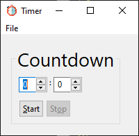

#  Glimmer Timer
## [ Glimmer Custom Shell](https://github.com/AndyObtiva/glimmer-dsl-swt#custom-shell-gem)

&nbsp;&nbsp;&nbsp;&nbsp;&nbsp;&nbsp;&nbsp;&nbsp;&nbsp;&nbsp;&nbsp;&nbsp;&nbsp;**Mac Version**

 

&nbsp;&nbsp;&nbsp;&nbsp;&nbsp;&nbsp;&nbsp;&nbsp;&nbsp;&nbsp;&nbsp;&nbsp;&nbsp;**Windows Version**
<br>
<br>
<br>
&nbsp;&nbsp;&nbsp;&nbsp;&nbsp;&nbsp;&nbsp;&nbsp;&nbsp;&nbsp;&nbsp;&nbsp;&nbsp;

<br>
<br>
<br>

&nbsp;&nbsp;&nbsp;&nbsp;&nbsp;&nbsp;&nbsp;&nbsp;&nbsp;&nbsp;&nbsp;&nbsp;&nbsp;**Linux Version**
<br>
<br>
<br>
&nbsp;&nbsp;&nbsp;&nbsp;&nbsp;&nbsp;&nbsp;&nbsp;&nbsp;&nbsp;&nbsp;&nbsp;&nbsp;

<br>
Glimmer Timer is a sample desktop GUI application built with Glimmer (JRuby Desktop Development GUI Library).

Currently supports a countdown timer only.

[ Download Mac Version](https://www.dropbox.com/s/t9q2znziupgqmt2/Timer-1.1.0.dmg?dl=1)

[ Download Windows Version](https://www.dropbox.com/s/f0epkjarz4l1u5a/Timer-1.1.0.msi?dl=1)

## Usage

### App Installer

Download and install the right installer for your platform:
- [Mac DMG File](https://www.dropbox.com/s/t9q2znziupgqmt2/Timer-1.1.0.dmg?dl=1)
- [Windows MSI File](https://www.dropbox.com/s/f0epkjarz4l1u5a/Timer-1.1.0.msi?dl=1)

Run by simply opening up the Timer application installed on your system.

### Command Gem

The `timer` command can be obtained from the [glimmer-cs-timer](https://rubygems.org/gems/glimmer-cs-timer) [JRuby](https://www.jruby.org/) gem and works on Mac and Linux:

- Ensure [Glimmer pre-requisites](https://github.com/AndyObtiva/glimmer-dsl-swt#pre-requisites)
- `gem install glimmer-cs-timer` (if you don't have [RVM](https://rvm.io), then prefix with `jruby -S` or run `jgem` instead)
- `timer`

## Tutorial

[How To Write a Glimmer Timer Desktop App in One Hour](https://andymaleh.blogspot.com/2020/08/writing-glimmer-timer-sample-app-in.html)

## Development

### Pre-requisites

If you would like to reuse as a library instead of a standalone application, here are the pre-requisites needed:

- [Glimmer DSL for SWT](https://github.com/AndyObtiva/glimmer-dsl-swt) application, [Glimmer](https://github.com/AndyObtiva/glimmer-dsl-swt) custom shell, or another [Glimmer](https://github.com/AndyObtiva/glimmer-dsl-swt) custom widget
- JRuby version required by [Glimmer](https://github.com/AndyObtiva/glimmer-dsl-swt)
- Java version required by [Glimmer](https://github.com/AndyObtiva/glimmer-dsl-swt)

### Setup

To setup for use in another [Glimmer](https://github.com/AndyObtiva/glimmer-dsl-swt) application, [Glimmer](https://github.com/AndyObtiva/glimmer-dsl-swt) custom shell, or another [Glimmer](https://github.com/AndyObtiva/glimmer-dsl-swt) custom widget, follow the instructions below.

#### Glimmer Application

Add the following to a Glimmer application `Gemfile`:

```ruby
gem 'glimmer-cs-timer', '1.1.0'
```

Run:

```
jruby -S bundle
```

(or just `bundle` if using RVM)

#### Glimmer Custom Shell or Glimmer Custom Widget

When reusing in a Glimmer custom shell or custom widget, you can follow the same steps for Glimmer application, and then add a require statement to your library file:

```ruby
require 'glimmer-cs-timer'
# ... more require statements follow
```

## Change Log

[CHANGELOG.md](CHANGELOG.md)

## Contributing to glimmer-cs-timer
 
- Check out the latest master to make sure the feature hasn't been implemented or the bug hasn't been fixed yet.
- Check out the issue tracker to make sure someone already hasn't requested it and/or contributed it.
- Fork the project.
- Start a feature/bugfix branch.
- Ensure [Glimmer pre-requisites](https://github.com/AndyObtiva/glimmer-dsl-swt#pre-requisites)
- `gem install bundler` (if you don't have [RVM](https://rvm.io), then prefix with `jruby -S` or run `jgem` instead)
- `bundle`
- Run app via `bin/timer` or `glimmer bin/glimmer-cs-timer` to ensure it works.
- Commit and push until you are happy with your contribution.
- If the changes include highly sophisticated pure model logic, then please cover it with [rspec](https://github.com/rspec/rspec) tests.

## Copyright

[MIT](https://opensource.org/licenses/MIT)

Copyright (c) 2020 Andy Maleh.

--

[](https://github.com/AndyObtiva/glimmer) Built with [Glimmer DSL for SWT](https://github.com/AndyObtiva/glimmer-dsl-swt) (JRuby Desktop Development GUI Library)

Icon made by <a href="https://www.flaticon.com/authors/freepik" title="Freepik">Freepik</a> from <a href="https://www.flaticon.com/" title="Flaticon"> www.flaticon.com</a>
